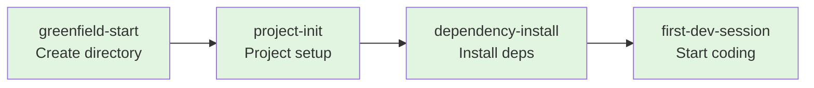
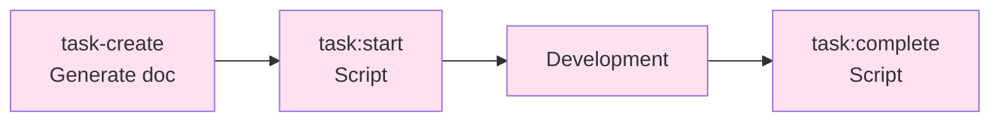
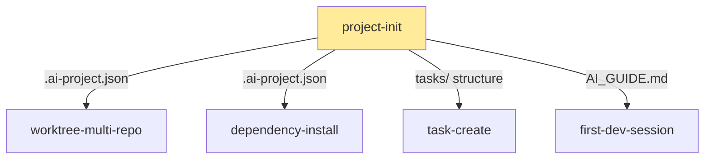

# Sample Dossier Registry

> **Note**: This is an example of how a dossier implementation might organize and document its dossiers. This shows organizational patterns, relationship mapping, and navigation structures. Your implementation may use a different structure based on your needs.

Complete catalog of all project dossiers with relationships, outputs, and navigation maps.

---

## Quick Reference

| Dossier | Version | Purpose | Journey | Coupling |
|---------|---------|---------|---------|----------|
| [greenfield-start](./greenfield-start.md) | 1.0.0 | Start new project from zero | Greenfield | Loose |
| [project-init](./project-init.md) | 1.0.0 | Initialize project structure | Both | Medium |
| [brownfield-adoption](./brownfield-adoption.md) | 1.0.0 | Add dossiers to existing project | Brownfield | Medium |
| [dependency-install](./dependency-install.md) | 1.0.0 | Install all dependencies | Both | Loose |
| [first-dev-session](./first-dev-session.md) | 1.0.0 | First productive session | Both | Loose |
| [worktree-multi-repo](./worktree-multi-repo.md) | 1.0.0 | Create multi-repo worktrees | Feature | Medium |
| [worktree-cleanup](./worktree-cleanup.md) | 1.0.0 | Remove worktrees | Feature | Medium |
| [task-create](./task-create.md) | 1.0.0 | Generate task documents | Feature | Loose |
| [project-uninstall](./project-uninstall.md) | 1.0.0 | Remove dossier system safely | Maintenance | Medium |

---

## Citizen Journeys

### Greenfield Journey (New Projects)

**Path**: Zero → Production in 4 steps

**Steps**:
1. **greenfield-start**: Create project directory, init git
2. **project-init**: Add dossier templates, customize for project
3. **dependency-install**: Install npm/pip/cargo dependencies
4. **first-dev-session**: Create first task, start developing

**Time to productive**: < 30 minutes

---

### Brownfield Journey (Existing Projects)

**Path**: Existing → Dossier-Enhanced in 2-3 steps

**Steps**:
1. **brownfield-adoption**: Backup, plan integration, merge strategy
2. **project-init**: Add dossier files (merge with existing)
3. **dependency-install**: Optional if deps already installed

**Time to enhanced**: < 20 minutes

---

## Feature Workflows

### Worktree Lifecycle

### Task Lifecycle

---

## Relationship Matrix

| From Dossier | To Dossier | Type | Coupling | Notes |
|--------------|------------|------|----------|-------|
| greenfield-start | project-init | Sequential | Loose | Creates directory for init |
| brownfield-adoption | project-init | Sequential | Medium | Merge mode required |
| project-init | dependency-install | Suggested | Medium | Provides .ai-project.json |
| project-init | first-dev-session | Suggested | Loose | Basic setup for dev |
| dependency-install | first-dev-session | Suggested | Loose | Deps needed for dev |
| project-init | worktree-multi-repo | Config provider | Medium | Provides repos list |
| worktree-multi-repo | worktree-cleanup | Opposite | Medium | Create ↔ Destroy |
| first-dev-session | task-create | Contains | Loose | Uses as sub-component |
| project-init | project-uninstall | Conflicts | Medium | Setup ↔ Teardown |

---

## Output Matrix

### What Each Dossier Produces

| Dossier | Key Outputs | Consumed By |
|---------|-------------|-------------|
| greenfield-start | Project directory, git repos | project-init |
| project-init | .ai-project.json, AI_GUIDE.md, tasks/ | worktree-multi-repo, dependency-install, task-create |
| brownfield-adoption | Backup files, backup branch | project-init |
| dependency-install | node_modules/, lock files | first-dev-session |
| worktree-multi-repo | .worktrees/[feature]/ | worktree-cleanup |
| task-create | Task .md file | task manager scripts |
| project-uninstall | Removed dossier files, archives | N/A (terminal) |

###Configuration Flow

---

## By Category

### Setup & Initialization
- **greenfield-start** - Brand new projects
- **project-init** - Core dossier setup
- **brownfield-adoption** - Existing projects
- **dependency-install** - Package installation

**Purpose**: Get projects dossier-ready

### Development Workflows
- **first-dev-session** - Onboarding walkthrough
- **task-create** - Task documentation
- **worktree-multi-repo** - Parallel development
- **worktree-cleanup** - Cleanup after features

**Purpose**: Day-to-day development operations

### Maintenance & Utilities
- **project-uninstall** - Remove dossier system

**Purpose**: Lifecycle management

---

## By Coupling Level

### Loose Coupling (Independent)
- greenfield-start
- dependency-install
- task-create
- first-dev-session

**Characteristics**: Can run standalone, minimal dependencies, graceful degradation

### Medium Coupling (Coordinated)
- project-init
- brownfield-adoption
- worktree-multi-repo
- worktree-cleanup
- project-uninstall

**Characteristics**: Share configuration, defined interfaces, managed dependencies

### Tight Coupling (Interdependent)
- None currently

**Note**: This implementation deliberately avoids tight coupling for flexibility

---

## Dossier Lifecycle States

### Entry Points (No prerequisites)
- greenfield-start
- brownfield-adoption

### Terminal Nodes (Nothing follows)
- first-dev-session (user continues development)
- project-uninstall (dossier system removed)
- worktree-cleanup (worktree removed)

### Middleware (Part of chains)
- project-init (hub connecting entry → features)
- dependency-install (setup → development bridge)

---

## Navigation Guide

### I want to start a new project
**Path**: greenfield-start → project-init → dependency-install → first-dev-session

### I have an existing project
**Path**: brownfield-adoption → project-init (merge) → development

### I want to work on a feature across multiple repos
**Path**: worktree-multi-repo → (development) → worktree-cleanup

### I want to create a task
**Path**: task-create → task:start (script)

### The dossier system didn't work for me
**Path**: project-uninstall

---

## See Also

- [Dossiers README](./README.md) - How to use dossiers
- [Protocol](./PROTOCOL.md) - Execution guidelines
- [Main README](../README.md) - Project overview

---

**📋 Sample Dossier Registry v1.0**
*Example of organizing and documenting dossier workflows*
